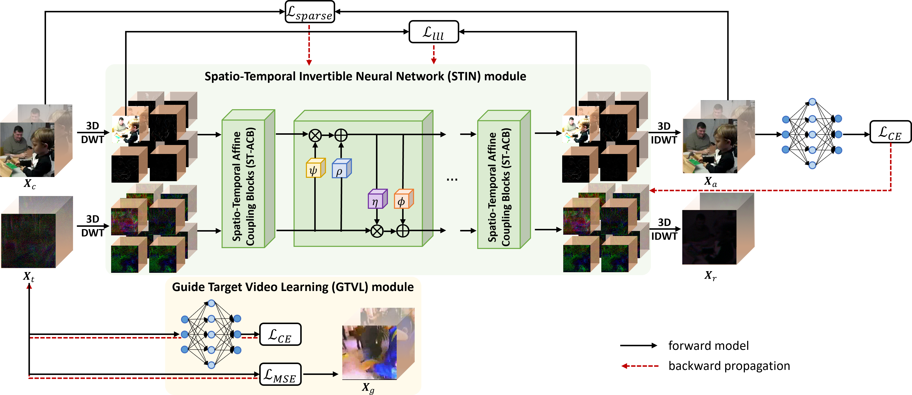

# SVASTIN: Sparse Video Adversarial Attack via Spatio-Temporal Invertible Neural Networks

[Yi Pan](panyi_jsjy@nudt.edu.cn), [Jun-Jie Huang*](https://jjhuangcs.github.io/) (jjhuang@nudt.edu.cn), [Zihan Chen](https://brittany-chen.github.io/)(chenzihan21@nudt.edu.cn), Wentao Zhao, and Ziyue Wang(*corresponding author)

Pytorch implementation for "SVASTIN: Sparse Video Adversarial Attack via Spatio-Temporal Invertible Neural Networks" (ICME'2024).



Robust and imperceptible adversarial video attack is challenging due to the spatial and temporal characteristics of videos. The existing video adversarial attack methods mainly take a gradient-based approach and generate adversarial videos with noticeable perturbations. In this paper, we propose a novel Sparse Adversarial Video Attack via Spatio-Temporal Invertible Neural Networks (SVASTIN) to generate adversarial videos through spatio-temporal feature space information exchanging. It consists of a Guided Target Video Learning (GTVL) module to balance the perturbation budget and optimization speed and a Spatio-Temporal Invertible Neural Network (STIN) module to perform spatio-temporal feature space information exchanging between a source video and the target feature tensor learned by GTVL module. Extensive experiments on UCF-101 and Kinetics-400 demonstrate that our proposed SVASTIN can generate adversarial examples with higher imperceptibility than the state-of-the-art methods with the higher fooling rate.


## Requisites

* PyTorch >= 2.1.1
* Python3 >= 3.10.13
* [pywavelets](https://github.com/KeKsBoTer/torch-dwt) >= 1.5.0
* [mmaction2](https://github.com/open-mmlab/mmaction2) >= 1.2.0
* NVIDIA GPU + CUDA CuDNN

## Preparation

### Dataset

Download dataset ([UCF-101](https://www.crcv.ucf.edu/research/data-sets/ucf101/) and [Kinetics-400](https://deepmind.com/research/open-source/open-source-datasets/kinetics/)) and prepare data by referring to [mmaction2](https://mmaction2.readthedocs.io/en/latest/).

### Models

Models on kinetics-400 dataset are are all available in [mmaction2](https://mmaction2.readthedocs.io/en/latest/) library. We consider three models (MVIT, SLOWFAST, and TSN). Except that, we fine-tune these models on UCF-101 dataset. You can find them in [Google Drive](https://drive.google.com/file/d/1nlaIvaQN6vmegId3UX3XjrPdSt6Nt82I/view?usp=drive_link).

## Run

You can run ```attack.py``` directly.

## Description of the files in this repository

1) ``attack.py``: Execute this file to attack 
2) ``args.py``: Video and model parameters setting 
3) ``config.py``: Hyperparameters setting
4) ``model/``: Architecture of Spatio-Temporal Invertible Neural Networks
6) ``checkpoints/``: Pre-trained model parameters


## Citation

If you find this code and data useful, please consider citing the original work by authors:

```

```